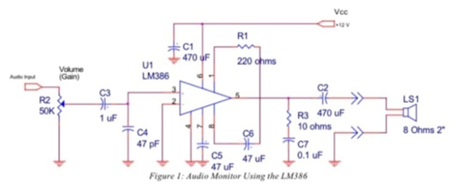
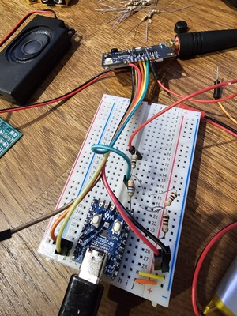

# SA828 volume control

SA828 specs tells as that you can control speaker volume but attaching 100K Ohm grounded potentiometer to port 16 (source) and port 17 (input).

I want to control volume using RP2040 micro-controller so after investigating that SA828 uses audio amplifier and port 16 and 17 carry analog audio signal I (with help from Krystian) decided to use **voltage divider** connected to MCU GPIO pins (OPEN_DRAIN). Those pins will ground divider resistors increasing resistance.

(Pin16) ---- R1 ----- (Pin17) ------ R2 ---- (MCU Pin 14)
                                |
                                ---- R3 ---- (MCU Pin 15)

Resistors:

R1: 50 Ohms

R2: 200 Ohms
R3: 500 Ohms

R2*R3 = 143 Ohms

